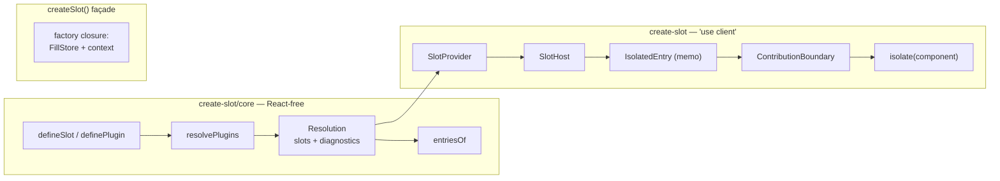

# Architecture

How 4.x is put together. The public story is in [REGISTRY.md](../REGISTRY.md);
this file is the internals map. The design decision behind the whole shape is
[ADR 0004](adr/0004-resolution-core.md).

## The shape

One idea: the registry is a pure function over serializable data, and
everything else is a thin adapter. The package splits at the only seam that
matters — React.

## File map

| file                          | contents                                                       | depends on |
| ----------------------------- | -------------------------------------------------------------- | ---------- |
| `lib/core/types.ts`           | Every core type; React appears as types only.                  | —          |
| `lib/core/define.ts`          | `defineSlot`, `definePlugin`.                                  | types      |
| `lib/core/resolve.ts`         | `resolvePlugins`, `entriesOf`.                                 | types      |
| `lib/adapter/provider.tsx`    | `SlotProvider`, three contexts, dev diagnostics printer.       | core       |
| `lib/adapter/boundary.tsx`    | `ContributionBoundary`.                                        | provider   |
| `lib/adapter/host.tsx`        | `SlotHost`, `HostEntry`, `IsolatedEntry`, `isolate`.           | boundary   |
| `lib/adapter/hooks.ts`        | `useSlotProps`, `useContribution`, `propsContextOf`.           | provider   |
| `lib/internal/stable-props.tsx` | `useStableProps`, `sameValues` — shared by adapter and façade. | —          |
| `lib/facade/store.ts`         | `FillStore` — one per factory.                                 | —          |
| `lib/facade/create-slot.tsx`  | `createSlot`, `RuntimeSlot`.                                   | store      |
| `lib/error-boundary.tsx`      | `PluginErrorBoundary` — unchanged since 3.x.                   | —          |
| `lib/index.ts`                | The client entry: re-exports core, adapter, façade.            | everything |
| `lib/core/index.ts`           | The core entry.                                                | core       |

## The resolver

`resolvePlugins` does during one pure call what v3 did across render-time
machinery: validity (ids non-empty, no `/`, unique per plugin), `disable`
(plugins whole, contributions by full id), `override` patches (last one per
target wins; slot mismatch is a diagnostic), grouping, sorting
(`order || pluginIndex || declaredIndex`), `seq` stamping, key minting
(`${pluginId}/${contributionId}`).

Two properties are load-bearing:

- **Determinism.** No dates, no randomness, inputs never mutated: deep-equal
  inputs give deep-equal Resolutions, which is the entire SSR contract.
- **Prototype safety.** `Resolution.slots` is built on a null-prototype
  record, and every read anywhere in the library is own-property only — a slot
  named `constructor` or `__proto__` is an ordinary key.

Diagnostics are returned, never thrown: one plugin's typo must not take the
application down, and "nothing is dropped silently" is a feature the docs
promise.

## The adapter

`SlotProvider` holds two contexts, because they change for different reasons:
the Resolution (rarely; every host cares) and the handlers
(`onError`/`Failed`/`Pending` — every render with inline props; only a
boundary with something to show cares). Diagnostics are printed from an
effect, dev-only, deduped by content — an inline `resolvePlugins()` per render
is legal and must not flood the console.

`SlotHost` re-renders when the Resolution or its own props change, and stops
everything at the entry boundary:

- **`useStableProps`** holds the props bag by value-compare — safe against
  discarded renders (identity can be lost, a stale value cannot).
- **`IsolatedEntry`** is memoised with a content comparator (key, ids, order,
  component identity — `resolvePlugins` mints fresh entry objects every call,
  so identity says nothing) plus value-compared props.
- **`isolate()`** caches a `memo` wrapper per author component in a WeakMap,
  so a rebuilt graph cannot remount or re-render a contribution.

The default layout is expressed through the same `renderEntries` path the
escape hatch uses, so the two cannot drift.

Per-slot props contexts anchor **on the descriptor**, cached lazily under
`Symbol.for("create-slot.props-context")`. A module-level WeakMap would be one
per bundled copy of the adapter (ESM/CJS interop), and a host from one copy
must meet `useSlotProps` from the other in a single context.

`ContributionBoundary` is exported: a hand-rolled host — including a server
component mapping a Resolution — keeps the same failure semantics as the
default one.

## The façade

`createSlot()` is the runtime channel, whole and alone. Each factory closes
over its own `FillStore` and props context: no module-level registry exists,
so two factories can never exchange fills and a duplicated package copy has
nothing to split. `getServerSnapshot` is empty by construction — server markup
is a function of the Resolution alone, and fills register from layout effects
after hydration. Fill identity (key, order, seq) is claimed once at mount;
content changes reconcile, never remount. Each fill renders inside
`Suspense fallback={null}` — a loop-breaker, not an isolation promise.

## Packaging

One tsup config, two entries, `splitting: true` — shared chunks are the point:
a second config would duplicate the shared modules, which is the v3 CJS
dual-store class of defect. No banner: it would land on every output file,
core and chunks included, and in CJS after the `"use strict"` preamble where a
directive is inert. `scripts/prepend-use-client.mjs` prepends `"use client"`
to exactly `dist/index.js` and `dist/index.cjs` after the build, and fails the
build if the directive appears anywhere else or a stale v3 artifact survives.
Sourcemaps are off — the prepend would shift every mapping by a line.

Three smokes guard the seam in CI:

- `npm run test:rsc` — under `node --conditions react-server`, the core entry
  loads by self-reference, the client entry **fails to**, and `dist/core` has
  no runtime react imports;
- `npm run test:chunks` — both entries in one CJS process share one copy of
  the shared modules (`Object.is` on `resolvePlugins`);
- `npm pack --dry-run` — the artifact list.

## Development diagnostics

Every dev-only branch is a module-level constant conditioned on the exact
expression `process.env.NODE_ENV !== "production"`, so bundlers strip the
whole function — messages included — from production builds.
`lib/adapter/adapter.test.tsx` re-imports the graph under a stubbed production
env and asserts the silence.
