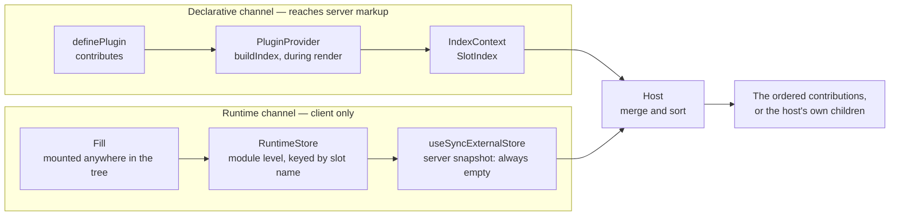

# Architecture

`create-slot` is a plugin registry for React. A feature declares what it
renders. The application decides where that UI appears. Neither one imports the
other.

The design follows from one decision: **a contribution is data, not an
element.** A host can enumerate data during render, so a server render sees the
complete list. A host cannot enumerate an element, because the element exists
only where a component mounted it — always later than the host that must render
it.

The library keeps one exception to that rule: the runtime channel. Version 2.x
shipped it, and it answers a case the declarative channel cannot. This document
maps how both channels are built, where they meet, and which invariants hold
them together.

Read [REGISTRY.md](../REGISTRY.md) for the user-facing model. Read
[CONTEXT.md](../CONTEXT.md) for the words this document uses.

## The modules

The library is six source files. `lib/create-slot.tsx` is the only entry point,
and the only file `tsup` bundles.

| Module               | Owns                                                                | Imports from      |
| -------------------- | ------------------------------------------------------------------- | ----------------- |
| `plugin.ts`          | The manifest types and `definePlugin`.                              | —                 |
| `runtime.ts`         | The module-level store of the runtime channel, and its two hooks.   | —                 |
| `error-boundary.tsx` | The class boundary that keeps one contribution's failure its own.   | —                 |
| `provider.tsx`       | `PluginProvider`, the declared index, and three contexts.           | `plugin.ts`       |
| `slot.tsx`           | `defineSlot`, `buildSlot`, the host, and the merge of the channels. | the four above    |
| `create-slot.tsx`    | The public exports, and the `createSlot` façade.                    | `slot.tsx`        |

Dependencies point one way, and there are no cycles. `plugin.ts`, `runtime.ts`
and `error-boundary.tsx` are leaves: each one depends on React alone. The host
in `slot.tsx` is the only module that knows both channels exist.

## Two channels, one host

Both channels deliver to the same host. Both rank on the same `order`.

### The declarative channel

`slot.contribute()` returns a plain object: a slot name, an order, and the
author's component with its props type erased. It wraps nothing and memoises
nothing. Erasure lets one index hold the contributions of every slot; the host
restores the type on the way out, and the slot's own generics guaranteed the
match at the call site.

`definePlugin` checks one thing — a non-empty id — and returns its argument. It
is generic over that argument, so an application's own fields keep their types.
The library reads two of them: `id` and `contributes`.

`PluginProvider` calls `buildIndex` inside `useMemo`, keyed on the `plugins`
array. `buildIndex` groups every contribution by slot name and sorts each group
once. The result is a `Map<string, DeclaredEntry[]>` in context. Nothing here
runs in an effect, so the server builds the same index as the client and the
markup agrees.

### The runtime channel

A `Fill` renders `null` at its own position. It calls `useRuntimeFill`, which
registers the child element into a module-level `RuntimeStore` from a layout
effect, and removes it on unmount. Every mounted host of that slot then renders
the element.

The store keeps three maps per slot name: the entries, a cached sorted snapshot,
and the listener set. `useSyncExternalStore` requires a stable snapshot, so
`getSnapshot` caches its sorted array and `invalidate` drops that cache on every
write. An idle slot returns a single shared `EMPTY` array, so it needs no cache
entry of its own.

The store cleans up after itself, because slot names can be generated per row.
The last fill to leave a slot removes the bucket. The last listener to
unsubscribe removes the listener set — after an identity check, so a host that
unsubscribes late cannot drop a set the slot has already replaced.
`trackedSlots()` is the internal seam that proves this, and only the library's
own tests read it.

One loaded copy of `runtime.ts` owns one store. Every React root using that copy
shares runtime fills by slot name; the declarative index is scoped to the nearest
`PluginProvider`. The asymmetry is deliberate: cross-root fills are part of the
runtime contract, while two providers may select different plugin lists.

`getServerSnapshot` returns `EMPTY`, always. React reads it on the server and
again for the first hydrating render. A server prepass could collect fills, but
the client could not reproduce entries from subtrees it has not reached yet, so
putting them in server markup would regenerate the root during hydration.
Effects are why registration happens later; the matching empty snapshots are
why the channel stays client-only. They also make a module-level store safe on
the server: concurrent renders never read client registrations.

### Where they meet

`useSlotEntries` reads the declared group from context, reads the runtime
snapshot from the store, and calls `merge`. The host renders the merged list. If
the list is empty, the host renders its own `children` as the placeholder.
`children` belongs to the host, not to `Props`, and the host never forwards it
to a contribution.

## Ordering

`order` is a priority, not an array index. Equal values are a stable tie, and
each channel breaks that tie on its own terms before the merge sees it.

| Stage                        | Sort keys, in order                        |
| ---------------------------- | ------------------------------------------ |
| `buildIndex`, per slot       | `order`, plugin position, declared position |
| `RuntimeStore.getSnapshot`   | `order`, registration sequence              |
| `merge`, in the host         | `order`, channel, sequence within channel   |

Each stage writes its resolved position back to the entry as `seq`, so the merge
compares one number instead of repeating the earlier rules.

A tie between the two channels resolves to the declared contribution. The server
already shipped that position in the HTML, so it keeps it.

## Identity and keys

A stable key is what lets content change without a remount.

- A declared contribution is keyed `${plugin.id}#${declaredIndex}`. Plugin ids
  must be unique, because a duplicate id collides two plugins' React keys.
  `PluginProvider` reports a duplicate in development, from an effect. It is the
  library's only check on a manifest. The declaration position is global to the
  plugin, so inserting or removing an entry shifts every later key, even across
  slots. A fixed-shape `contributes` array is therefore part of stable identity.
- A fill is keyed `runtime-${seq}` from a module-level counter that never
  resets. The key and the `order` are read once, on mount, and held in a ref.
  A fill that re-renders with a new `order` keeps its place. A fill whose
  content changes keeps its key, so React reconciles the new element against the
  old one.
- `useRuntimeFill` writes on every change and removes only on unmount, in two
  separate effects. Changed content therefore never leaves a gap between two
  commits.

## The SSR contract

The library asks the application for one thing: **give the server and the client
the same `plugins` array, in the same order.** Everything else is derived from
that array during render.

The library does not enforce this, and cannot. If a tenant, a user or a flag
decides the enabled set, that set is data — send it with the HTML.
`lib/ssr.test.tsx` holds both directions: identical lists hydrate silently, and a
different client list produces a mismatch.

## Re-render containment

A host re-renders whenever a component above it re-renders, and it hands each
contribution the props it received. Without protection, one feature's state
change re-renders every other feature in the slot. Three mechanisms prevent that,
and they are independent.

1. **The host holds its props by value.** `useStableProps` keeps a ref and
   replaces it only when the key set or a value changes. JSX builds a fresh
   props object on every parent render, so identity alone proves nothing. A prop
   that is itself rebuilt each render still counts as new, exactly as it would to
   `memo`. The ref is written during render, which a discarded render can leave
   holding uncommitted props; what comes back is still an object whose values are
   `Object.is`-equal to the current props, so an abandoned render costs identity,
   never correctness.
2. **The memoised view is cached on the author's component.** `isolate` holds a
   `WeakMap` from the author's component to `memo(component)`. It is not applied
   in `contribute`, because a contribution must stay plain data for a server
   render to enumerate it — and because a stable component identity and a
   fixed-shape manifest stop a rebuilt index from remounting contributions.
3. **The contexts are split by reason to change.** `IndexContext` changes when
   the plugin list changes: rarely, and every host cares. `HandlersContext`
   changes whenever the application re-renders the provider with fresh arrows:
   constantly, and no host cares. One shared context would have turned every
   inline `onError` into an application-wide re-render. The handlers are read
   where a contribution is isolated, not where a slot is read.

`lib/perf.test.tsx` holds the result as a budget. `npm run bench` measures it:
about 5× on a slot with 100 contributions.

## Failure isolation

`IsolatedContribution` wraps each declared contribution in three layers:
`PluginIdProvider`, then `PluginErrorBoundary`, then `Suspense`. Isolation is the
host's job, not the contribution author's.

The boundary has no reset-on-update, on purpose. It sits directly around the
contribution, in the same commit, so React's own behaviour is enough. An
automatic reset would loop as soon as the host re-rendered in response to
`onError`. Recovery is explicit: the library hands `reset()` to `renderFailed`.

On the server, `getDerivedStateFromError` does not run, but the `Suspense`
boundary still does. React marks that one boundary for a client render and keeps
the rest of the markup. One broken contribution costs its own line, not the page.

A runtime fill gets only a `Suspense` boundary with a `null` fallback. Without
it, a suspended host can hide the Fill subtree, remove its registration, reveal
it, and repeat forever. A fill gets no error boundary or plugin identity: it is
the application's own element, so the author still owns failures and visible
pending UI.

## The client-graph boundary

`defineSlot` calls `createContext`. `PluginProvider` calls `useEffect`, and a
host calls `useContext`. The `react-server` build of React exports none of the
three; `useMemo` is the one it does export. Every module that reaches a manifest
therefore belongs to the client graph, and a server component that imports one
does not compile.

Server rendering still works, because React renders client components on the
server. Two things move instead:

- A **client boundary** module carries `"use client"`, holds `PluginProvider`,
  and imports the manifests.
- A server component sends plugin **ids** across that boundary, never plugins. A
  component cannot be a prop of a server component.
- Data the server must read about a plugin — a loader, a capability key — needs
  a **server seam**: a module the server graph can import, separate from the
  manifest that points at it.

The library ships no `"use client"` directive of its own. That would make the
whole package client-only, `definePlugin` included, and would freeze a
framework-specific directive into a framework-agnostic library. See
[ADR 0002](adr/0002-manifest-lives-in-the-client-graph.md).

## The `createSlot` façade

`create-slot.tsx` is a thin façade over the runtime channel. `createSlot()` calls
`buildSlot` with a generated name, `create-slot:N`, from a module-level counter —
the registry keys contributions by name, so two factories must stay isolated. The
returned `Slot` is the registry's `Fill`. `Host` and `useProps` are the
registry's own.

Two seams pay for the published 2.x signature:

- `buildSlot` takes a `requireProvider` flag. The façade passes `false`, because
  its API never had a provider; a missing provider there simply means no declared
  contributions. Everywhere else a missing provider is a mistake worth throwing
  for.
- `createSlot<Props>()` has never constrained `Props`, so the registry is widened
  with `& object` and narrowed back. `useProps` is nullable in the registry,
  honestly — a host is not guaranteed above you — while a `Slot`'s children only
  ever render inside one.

The façade keeps the older wording, where a `Slot` is the thing that contributes.
Both vocabularies survive on purpose. See
[ADR 0001](adr/0001-two-vocabularies.md).

## Invariants

Do not break these without a version to break them in.

1. The server and the client receive the same plugin list, in the same order.
2. Plugin ids are unique.
3. `getServerSnapshot` returns an empty list, always.
4. A fill reads its `order` and its key once, at mount.
5. `contribute()` returns the author's component, unchanged and unwrapped.
6. A slot with no fill and no host leaves nothing in the store.
7. An `order` tie between the channels resolves to the declared contribution.
8. Runtime fills are shared by React roots using one loaded package copy;
   declared contributions are scoped to their `PluginProvider`.

## Where the architecture is tested

| File                     | Holds                                                             |
| ------------------------ | ----------------------------------------------------------------- |
| `create-slot.test.tsx`   | The façade: ordering, multiple hosts, props, identity, misuse.    |
| `registry.test.tsx`      | The declarative channel end to end, and both channels together.   |
| `runtime-store.test.tsx` | The store's bookkeeping, read through `trackedSlots()`.           |
| `ssr.test.tsx`           | The SSR contract, both directions, and server-side isolation.     |
| `streaming.test.tsx`     | `renderToPipeableStream`: shell first, slow contribution later.   |
| `perf.test.tsx`          | Re-render containment, as a budget.                               |
| `perf.bench.tsx`         | The measurement behind `npm run bench`.                           |

## What is deliberately absent

The library knows who contributes what, in what order, and what happens when a
contribution breaks. The application owns everything else: state, lifecycle,
commands, routing, visibility predicates and inventory. A contribution controls
its own visibility by returning `null`.

The manifest is open data, and `definePlugin` is generic over it, so an
application extends it with its own typed fields. [REGISTRY.md](../REGISTRY.md) explains each
omission and shows what the examples build in its place.
